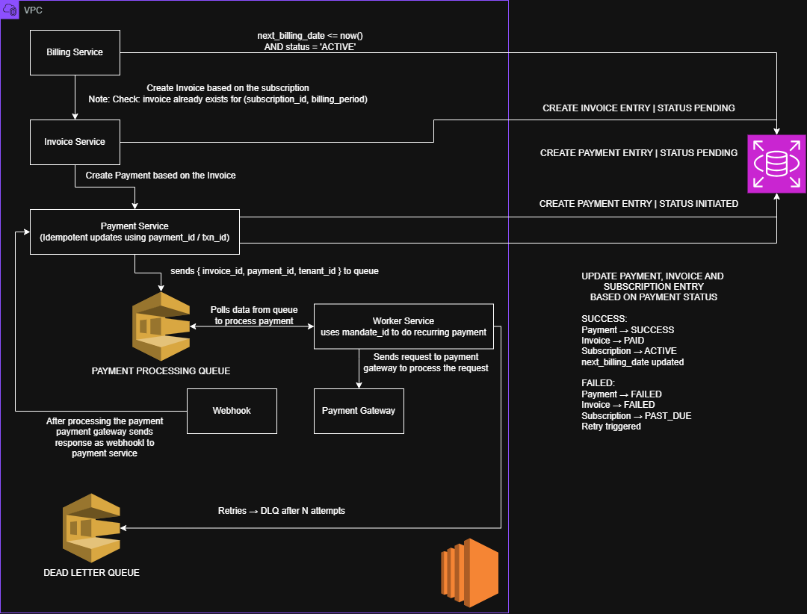

## Problem Statement
- Small and medium businesses often lack reliable systems to manage recurring payments, track subscriptions, and handle billing efficiently. Manual processes lead to missed payments, inconsistent billing, and poor visibility into revenue.
- This system provides a centralized platform to automate billing, manage subscriptions, and ensure reliable payment tracking.

   
## Users
- Primary Users ( Merchants ):
    - Business such as gym's, SaaS companies, and service providers
    - They create plans, manage customers, and track payments
- Secondary Users ( Customers ):
    - End users who subscribe to services and make payments

## This Projects Scope / MVP Feature
- Merchant onboarding (tenant + user)
- Customers management
- Plan creation (monthly/yearly)
- Subscription creation
- Invoice generation
- Payment simulation (success/failure)
- basic audit logging

## Core Domain Concepts
- Tenant: Business using the platform
- User: Internal user of the tenant
- Customer: End user who pays
- Plan: Subscription offering
- Subscription: Active plan for a customer
- Invoice: Bill generated for payment
- Payment: Transaction made against invoice

## Constraints & Assumptions
- System is multi-tenant (data isolated by tenant_id)
- Payments are simulated (no real gateway i.e Sandbox will be used)
- System must handle recurring billing
- Backend-only System (API Driven for now)

## DB Diagram

# System Design Diagram
## First Time Payment High Level Design
- Flow Explanation
    - User initiates subscription request
    - Subscription Service creates subscription (PENDING)
    - Invoice Service creates invoice (PENDING)
    - Payment Service creates payment (INITIATED)
    - Payment request is pushed to queue
    - Worker consumes queue and calls external payment gateway
    - Payment gateway send webhook response
    - Payment Service updates:
        - Payment - SUCCESS/FAILES
        - Invoice - PAID/FAILED
        - Subscription - ACTIVE/PAST_DUE
## Key Design Decisions
- Invoice as source of Truth
    - Payment is tied to invoice
    - Subscription depends on invoice status
- Asynchronous Processing
    - Decouples request from execution
    - Improves scalability and reliability
    Uses: Amazon SQS
## Idempotency
- Ensures safe retries (queue + webhook)
- Implemented using payment_id / txn_id
## Retry & Failure Handling
- Failed messages retried automatically
- After max attempts -> moved to Dead Letter Queue (DLQ)
## Webhook-Based Confirmation
- External Payment gateway sends final status
- System does not rely on synchronous response

## Recurring Payment High Level Design
- Flow Explanation
    - Billing Service (Scheduler) pulls subscriptions:
        - next_billing_date <= now()
        - status = ACTIVE
    - Billing Service processes subscriptions in batches
    - Invoice Service creates invoice (PENDING)
        - Ensures idempotency (no duplicate invoice for same billing period)
    - Payment Service creates payment (INITIATED)
        - Linked with invoice_id and mandate_id
    - Payment request is pushed to queue
    - Worker consumes queue and:
        - Uses mandate_id to trigger recurring payment 
        - Calls external payment gateway
    - Payment gateway sends webhook response
    - Payment Service updates:
        - Payment -> SUCCESS / FAILED
        - INVOICE -> PAID / FAILED
        - Subscription:
            - Success -> ACTIVE + update next_billing_date
            - FAILED -> PAST_DUE + trigger retry
 ## Key Design Decisions
 ## Invoice as Source of Truth 
- Payment is always tied to invoice
- Subscription state depends on invoice outcome
- Prevents inconsistencies in financial data

## Scheduled Billing (Core of Recurring System)
- Billing runs as a scheduler (cron-based)
- Pulls only due subscriptions
- Ensures continuous billing cycles

## Asynchronous Processing
- Decouples billing from payment execution
- Improves scalability and fault tolerance
Uses: Amazon SQS

## Idempotency
## At Billing Level
- Prevent duplicate invoices:
    - (subscription_id, billing_period) must be unique
## At Payment Level
- Ensures safe retries (queue + webhook)
- Implemented using payment_id / txn_id

## Retry & Failure Handling
- Failed payments are retried with backoff strategy
    - e.g 1 hour -> 24 hours -> next cycle
- Messages retried automatically via queue
- After max attempts -> moved to Dead Letter Queue (DLQ)

## Mandate-Based Recurring Payments
- Payments executed using stored mandate_id
- No user interaction required for recurring cycles
- Ensures seamless auto-debit functionally

## Webhook-Based Confirmation
- External payment gateway sends final status
- System does not reply on synchronous response
- Webhook is:
    - Idempotent
    - Secure (Signature Validation recommended)

## Reliability Considerations
- Idempotent billing + payment processing
- Queue visibility timeout prevents duplicate processing
- DLQ for failed message isolation
- Batched processing for scalability
- Optional locking to void concurrent billing runs

